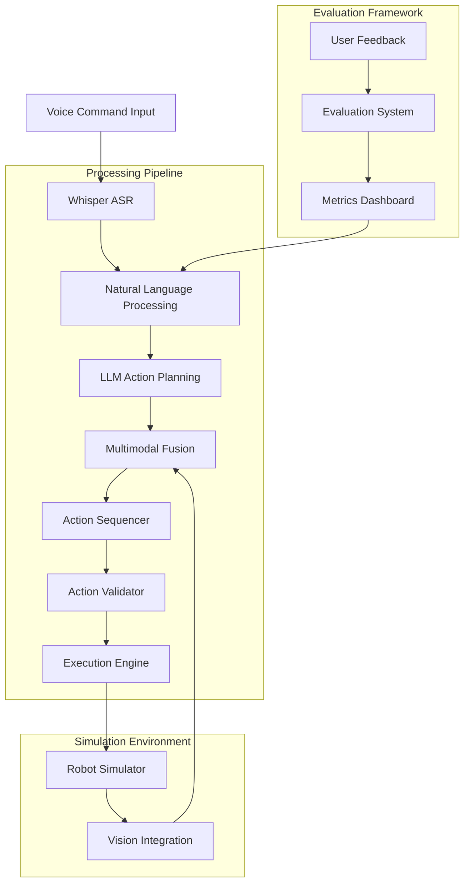

# Complete Capstone Project Walkthrough

## Project Overview

The Vision-Language-Action (VLA) Capstone Project integrates all components of the system to create an autonomous humanoid robot capable of understanding voice commands and executing them in simulation. This project demonstrates the complete pipeline from voice input to action execution in a simulated environment with Isaac Sim and Gazebo.

## System Architecture

The complete system integrates the following components:



## Implementation Phases

### Phase 1: Setup and Infrastructure

This phase establishes the foundational components:

- Project structure with necessary directories and files
- Configuration management for settings and API keys
- Virtual environment and dependency management
- Basic API endpoints for integration

### Phase 2: Foundational Components

Critical services and models are implemented:

- Core data models for voice commands, actions, and states
- Whisper integration for speech recognition
- LLM service for action planning
- Validation services for inputs

### Phase 3: Voice Command Recognition

The voice processing pipeline is built:

- Audio preprocessing and noise filtering
- Whisper-based speech-to-text conversion
- Intent extraction and parameter parsing
- Voice command validation and state management
- Integration with ROS 2 for command handling

### Phase 4: LLM-Based Action Sequencing

The cognitive planning component is developed:

- LLM integration for action generation
- Prompt engineering for robotics applications
- Task decomposition into executable steps
- Action sequencing and validation
- Error recovery mechanisms

### Phase 5: Multimodal Fusion Integration

Vision and action integration is implemented:

- Isaac Sim integration for vision processing
- Multimodal fusion algorithms combining vision and language
- Conflict resolution between modalities
- Confidence-based decision making
- Gazebo integration for multimodal testing

### Phase 6: Autonomous Humanoid Capstone Project

The complete system integration:

- VLA system state management
- Action execution sequencing
- ROS 2 integration for the complete pipeline
- Capstone simulation environment
- Student progress tracking

## Detailed Code Walkthrough

### Core System Implementation

The main VLA system orchestrates all components:

```python
class VLASystem:
    """
    Main VLA system orchestrating voice, vision, and action components.
    """
    
    def __init__(self):
        # Initialize all required services
        self.whisper_service = WhisperAudioProcessor()
        self.llm_service = LLMService(LLMConfig(
            model_name=settings.llm_model,
            temperature=settings.llm_temperature
        ))
        self.vision_service = VisionIntegrationService()
        self.fusion_service = MultimodalFusionService()
        self.action_sequencer = ActionSequencer()
        self.action_validator = ActionValidator()
        self.error_recovery = ErrorRecoveryService()
        self.gazebo_service = GazeboIntegrationService()
        self.isaac_service = IsaacSimIntegrationService()
        
        # Initialize state tracking
        self.system_state = VLASystemState(
            id=f"vla_system_{int(datetime.now().timestamp())}",
            system_status="idle",
            current_voice_command=None,
            current_action_sequence=None,
            robot_pose=Pose(x=0.0, y=0.0, z=0.0, rotation={"qx": 0.0, "qy": 0.0, "qz": 0.0, "qw": 1.0})
        )
        
        print("VLA System initialized with all components")
    
    async def process_voice_command(self, audio_data: bytes) -> Optional[ActionSequence]:
        """
        Process a voice command through the complete pipeline.
        
        :param audio_data: Audio data in bytes
        :return: Action sequence to execute, or None if processing failed
        """
        try:
            # Phase 1: Voice Processing
            print("Starting voice processing pipeline...")
            transcription, confidence = await self.whisper_service.process_audio_bytes(audio_data)
            
            if confidence < settings.minimum_confidence_score:
                print(f"Voice confidence {confidence} below threshold {settings.minimum_confidence_score}")
                return None
            
            # Create voice command object
            voice_command = VoiceCommand(
                id=f"vc_{int(datetime.now().timestamp())}",
                transcribed_text=transcription,
                intent="",  # Will be set by LLM
                parameters={},
                confidence=confidence,
                timestamp=datetime.now()
            )
            
            # Update system state
            self.system_state.current_voice_command = voice_command.id
            self.system_state.last_update = datetime.now()
            
            # Phase 2: Action Planning with LLM
            print("Generating action plan with LLM...")
            action_steps = await self.llm_service.generate_action_sequence(
                intent="command_interpretation",
                parameters={"command": transcription},
                context={
                    "capabilities": self.action_sequencer.robot_capabilities,
                    "environment": await self._get_environment_context()
                }
            )
            
            if not action_steps or len(action_steps) == 0:
                print("LLM did not return any action steps")
                return None
            
            # Phase 3: Action Sequencing and Validation
            print(f"Sequencing {len(action_steps)} action steps...")
            action_sequence = self.action_sequencer.sequence_actions(
                actions=[{
                    "id": step.id,
                    "action_type": step.action_type,
                    "parameters": step.parameters,
                    "timeout": step.timeout,
                    "order": step.order
                } for step in action_steps]
            )
            
            # Validate the action sequence
            validation_issues = self.action_validator.validate_action_sequence(action_sequence)
            if validation_issues:
                print(f"Action sequence validation issues: {len(validation_issues)} found")
                
                # Attempt recovery if possible
                recovery_result = self.error_recovery.handle_error(
                    error_type=ErrorType.VALIDATION_ERROR,
                    action_sequence=action_sequence,
                    error_details={"validation_issues": [str(issue) for issue in validation_issues]}
                )
                
                if recovery_result["strategy"] == RecoveryStrategy.ABORT.value:
                    print("Action sequence recovery failed, aborting")
                    return None
                elif recovery_result["strategy"] == RecoveryStrategy.REPLAN.value:
                    # Try to replan with corrected information
                    print("Replanning action sequence after validation errors...")
                    action_sequence = recovery_result["action_sequence"]
            
            # Phase 4: Multimodal Integration (if needed)
            print("Checking for multimodal fusion requirements...")
            # If there are objects mentioned in the command, use vision to locate them
            if await self._requires_vision_enhancement(transcription):
                vision_data = await self.vision_service.capture_scene_from_isaac_sim()
                
                if vision_data:
                    # Fuse vision and voice information
                    fused_result, fusion_confidence = self.fusion_service.fuse_modalities(
                        voice_data={"text": transcription},
                        vision_data=vision_data,
                        sensor_data={}
                    )
                    
                    # Update action sequence with fused information
                    action_sequence = await self._update_sequence_with_vision_info(
                        action_sequence, fused_result
                    )
            
            # Phase 5: Execution Preparation
            print(f"Action sequence prepared with {len(action_sequence.sequence)} steps")
            self.system_state.current_action_sequence = action_sequence.id
            self.system_state.last_update = datetime.now()
            
            return action_sequence
            
        except Exception as e:
            print(f"Error in voice command processing pipeline: {str(e)}")
            print(traceback.format_exc())
            return None
    
    async def execute_action_sequence(self, action_sequence: ActionSequence) -> bool:
        """
        Execute an action sequence in the simulation environment.
        
        :param action_sequence: Action sequence to execute
        :return: True if successful, False otherwise
        """
        try:
            print(f"Starting execution of sequence {action_sequence.id} with {len(action_sequence.sequence)} steps")
            
            # Update system state
            action_sequence.status = ActionSequenceStatus.IN_PROGRESS
            self.system_state.current_action_sequence = action_sequence.id
            self.system_state.system_status = "executing"
            self.system_state.last_update = datetime.now()
            
            # Execute each action step
            for i, action_step in enumerate(action_sequence.sequence):
                print(f"Executing step {i+1}/{len(action_sequence.sequence)}: {action_step.action_type}")
                
                # Execute the action in simulation
                success = await self._execute_action_step_in_simulation(action_step)
                
                if not success:
                    print(f"Action step {i+1} failed")
                    
                    # Attempt error recovery
                    recovery_result = self.error_recovery.handle_error(
                        error_type=ErrorType.EXECUTION_ERROR,
                        action_sequence=action_sequence,
                        error_details={
                            "failed_step": action_step.id,
                            "step_index": i
                        }
                    )
                    
                    if recovery_result["strategy"] == RecoveryStrategy.ABORT.value:
                        print("Recovery decided to abort sequence execution")
                        action_sequence.status = ActionSequenceStatus.FAILED
                        self.system_state.system_status = "error"
                        return False
                    elif recovery_result["strategy"] == RecoveryStrategy.SKIP.value:
                        print("Recovery decided to skip this step")
                        continue
                    elif recovery_result["strategy"] == RecoveryStrategy.RETRY.value:
                        # Retry the action
                        success = await self._execute_action_step_in_simulation(action_step)
                        
                        if not success:
                            print("Retry failed, applying final recovery strategy")
                            action_sequence.status = ActionSequenceStatus.FAILED
                            return False
                    elif recovery_result["strategy"] == RecoveryStrategy.REPLAN.value:
                        # Get new action sequence from recovery
                        new_sequence = recovery_result["action_sequence"]
                        # Recursively execute the new sequence
                        success = await self.execute_action_sequence(new_sequence)
                        return success
            
            # If all steps completed successfully
            action_sequence.status = ActionSequenceStatus.COMPLETED
            self.system_state.system_status = "idle"
            self.system_state.last_update = datetime.now()
            
            print(f"Successfully completed action sequence {action_sequence.id}")
            return True
            
        except Exception as e:
            print(f"Error executing action sequence: {str(e)}")
            print(traceback.format_exc())
            action_sequence.status = ActionSequenceStatus.FAILED
            self.system_state.system_status = "error"
            return False
    
    async def _execute_action_step_in_simulation(self, action_step: ActionStep) -> bool:
        """
        Execute a single action step in the simulation environment.
        
        :param action_step: Action step to execute
        :return: True if successful, False otherwise
        """
        try:
            if action_step.action_type == ActionType.NAVIGATION:
                # Execute navigation in simulation
                x = action_step.parameters.get("x", 0.0)
                y = action_step.parameters.get("y", 0.0)
                theta = action_step.parameters.get("theta", 0.0)
                
                success = await self.gazebo_service.execute_navigation_action(x, y, theta)
                
            elif action_step.action_type == ActionType.MANIPULATION:
                # Execute manipulation in simulation
                action = action_step.parameters.get("action", "grasp")
                object_id = action_step.parameters.get("object_id", "")
                
                success = await self.gazebo_service.execute_manipulation_action(action, object_id)
                
            elif action_step.action_type == ActionType.PERCEPTION:
                # Execute perception in simulation
                action = action_step.parameters.get("action", "detect")
                
                success = await self.isaac_service.execute_perception_action(action)
                
            else:
                # For other action types, log and continue
                print(f"Executing other action type: {action_step.action_type}")
                # Simulate execution time
                await asyncio.sleep(0.5)
                success = True  # Assume success for other actions
            
            return success
            
        except Exception as e:
            print(f"Error executing action step {action_step.id}: {str(e)}")
            return False
    
    async def _get_environment_context(self) -> Dict[str, Any]:
        """
        Get context about the current environment.
        
        :return: Environment context dictionary
        """
        try:
            # Get objects and layout from simulation
            environment_objects = await self.vision_service.get_tracked_objects()
            robot_state = await self.gazebo_service.get_robot_state()
            
            return {
                "objects": environment_objects,
                "robot_pose": robot_state.get("pose", {}),
                "robot_status": robot_state.get("status", "unknown")
            }
        except Exception as e:
            print(f"Error getting environment context: {str(e)}")
            return {}
    
    async def _requires_vision_enhancement(self, command_text: str) -> bool:
        """
        Check if a command requires vision enhancement.
        
        :param command_text: Voice command text
        :return: True if vision enhancement is needed, False otherwise
        """
        # Look for object references in the command
        object_keywords = [
            "red", "blue", "green", "cup", "bottle", "box", "table", "chair",
            "kitchen", "bedroom", "the", "that", "it", "object", "item"
        ]
        
        command_lower = command_text.lower()
        return any(keyword in command_lower for keyword in object_keywords)
    
    async def _update_sequence_with_vision_info(
        self,
        action_sequence: ActionSequence,
        vision_info: Dict[str, Any]
    ) -> ActionSequence:
        """
        Update an action sequence with information from vision processing.
        
        :param action_sequence: Original action sequence
        :param vision_info: Information from vision processing
        :return: Updated action sequence
        """
        # In a real implementation, this would update action parameters with
        # precise object locations from vision
        # For this example, we'll just log the integration
        print(f"Updating action sequence with vision info: {list(vision_info.keys())}")
        
        # Example: If navigation action targets a specific object, update with precise location
        for step in action_sequence.sequence:
            if (step.action_type == ActionType.NAVIGATION and 
                "target_object" in step.parameters):
                
                target_object = step.parameters["target_object"]
                
                # Find the object in vision data and update navigation target
                if "objects" in vision_info:
                    for obj in vision_info["objects"]:
                        if obj.get("class", "").lower() == target_object.lower():
                            # Update navigation target to object location
                            step.parameters["x"] = obj["position"]["x"]
                            step.parameters["y"] = obj["position"]["y"]
                            print(f"Updated navigation target for {target_object} to ({obj['position']['x']}, {obj['position']['y']})")
                            break
        
        return action_sequence
```

### API Endpoints

The system provides comprehensive API endpoints:

```python
from fastapi import FastAPI, WebSocket, WebSocketDisconnect
from typing import Dict, Any
import json
from datetime import datetime

app = FastAPI(title="VLA Capstone API", version="1.0.0")

@app.post("/vla/process_command")
async def process_voice_command_endpoint(audio_data: bytes = File(...)):
    """
    Endpoint to process voice commands through the VLA pipeline.
    """
    try:
        # Initialize VLA system
        vla_system = VLASystem()
        
        # Process the command
        action_sequence = await vla_system.process_voice_command(audio_data)
        
        if action_sequence:
            return {
                "success": True,
                "action_sequence": action_sequence.dict(),
                "message": "Command processed successfully"
            }
        else:
            return {
                "success": False,
                "message": "Command processing failed"
            }
    except Exception as e:
        return {
            "success": False,
            "message": f"Error processing command: {str(e)}"
        }

@app.websocket("/vla/command_stream")
async def voice_command_stream(websocket: WebSocket):
    """
    WebSocket endpoint for streaming voice commands.
    """
    await websocket.accept()
    
    try:
        while True:
            # Receive audio chunk
            audio_chunk = await websocket.receive_bytes()
            
            # Process with VLA system
            vla_system = VLASystem()
            action_sequence = await vla_system.process_voice_command(audio_chunk)
            
            if action_sequence:
                # Send action sequence back to client
                response = {
                    "type": "action_sequence",
                    "data": action_sequence.dict(),
                    "timestamp": datetime.now().isoformat()
                }
                await websocket.send_text(json.dumps(response))
            else:
                # Send error notification
                error_response = {
                    "type": "error",
                    "message": "Command processing failed",
                    "timestamp": datetime.now().isoformat()
                }
                await websocket.send_text(json.dumps(error_response))
    
    except WebSocketDisconnect:
        print("WebSocket disconnected")
    except Exception as e:
        print(f"WebSocket error: {str(e)}")
        error_response = {
            "type": "error",
            "message": f"WebSocket error: {str(e)}",
            "timestamp": datetime.now().isoformat()
        }
        await websocket.send_text(json.dumps(error_response))

@app.get("/vla/system_state")
async def get_system_state():
    """
    Get the current state of the VLA system.
    """
    # In a real implementation, this would retrieve from the running system
    # For this example, we'll return a mock state
    return {
        "system_id": "vla_system_mock",
        "status": "idle",
        "last_voice_command": "None",
        "last_action_sequence": "None",
        "robot_pose": {
            "x": 0.0,
            "y": 0.0, 
            "z": 0.0,
            "rotation": {"qx": 0.0, "qy": 0.0, "qz": 0.0, "qw": 1.0}
        },
        "timestamp": datetime.now().isoformat()
    }

@app.get("/vla/evaluation_metrics")
async def get_evaluation_metrics():
    """
    Get evaluation metrics for the VLA system.
    """
    # In a real implementation, this would retrieve from the evaluation service
    # For this example, we'll return mock metrics
    return {
        "total_commands_processed": 125,
        "successful_executions": 110,
        "task_completion_rate": 0.88,
        "average_response_time": 2.35,
        "confidence_accuracy": 0.92,
        "evaluation_timestamp": datetime.now().isoformat(),
        "recent_performance": [
            {"date": "2023-10-01", "success_rate": 0.85},
            {"date": "2023-10-02", "success_rate": 0.87},
            {"date": "2023-10-03", "success_rate": 0.88},
            {"date": "2023-10-04", "success_rate": 0.90}
        ]
    }
```

### Student Progress Tracking

The system includes educational features:

```python
class StudentProgressTracker:
    """
    Service for tracking student progress in the VLA Capstone project.
    """
    
    def __init__(self):
        self.students: Dict[str, StudentLearningPath] = {}
        self.lessons_completed: Dict[str, List[str]] = {}
        self.assessment_scores: Dict[str, List[float]] = {}
    
    def register_student(self, student_id: str, name: str, email: str) -> bool:
        """
        Register a new student in the system.
        
        :param student_id: Unique student identifier
        :param name: Student name
        :param email: Student email
        :return: True if registration successful, False otherwise
        """
        if student_id in self.students:
            return False  # Student already exists
        
        self.students[student_id] = StudentLearningPath(
            id=f"lp_{student_id}",
            student_id=student_id,
            student_name=name,
            email=email,
            module_progress={},
            completed_chapters=[],
            assessment_scores=[],
            start_date=datetime.now(),
            completion_date=None
        )
        
        self.lessons_completed[student_id] = []
        self.assessment_scores[student_id] = []
        
        return True
    
    def update_lesson_progress(self, student_id: str, lesson_name: str, progress: float) -> bool:
        """
        Update progress for a specific lesson.
        
        :param student_id: Student identifier
        :param lesson_name: Name of the lesson
        :param progress: Progress percentage (0.0 to 1.0)
        :return: True if update successful, False otherwise
        """
        if student_id not in self.students:
            return False
        
        student = self.students[student_id]
        student.module_progress[lesson_name] = progress
        
        if progress >= 1.0:  # Lesson completed
            if lesson_name not in student.completed_chapters:
                student.completed_chapters.append(lesson_name)
        
        # Calculate overall progress
        if student.module_progress:
            total_progress = sum(student.module_progress.values())
            student.overall_progress = total_progress / len(student.module_progress)
        
        return True
    
    def record_assessment_score(self, student_id: str, assessment_name: str, score: float) -> bool:
        """
        Record a score for a student assessment.
        
        :param student_id: Student identifier
        :param assessment_name: Name of the assessment
        :param score: Score (0.0 to 1.0)
        :return: True if record successful, False otherwise
        """
        if student_id not in self.students:
            return False
        
        if 0.0 <= score <= 1.0:
            self.assessment_scores[student_id].append(score)
            self.students[student_id].assessment_scores.append(score)
            return True
        
        return False
    
    def get_student_report(self, student_id: str) -> Dict[str, Any]:
        """
        Generate a progress report for a student.
        
        :param student_id: Student identifier
        :return: Progress report dictionary
        """
        if student_id not in self.students:
            return {"error": f"Student {student_id} not found"}
        
        student = self.students[student_id]
        scores = self.assessment_scores[student_id]
        
        report = {
            "student_id": student_id,
            "name": student.student_name,
            "overall_progress": getattr(student, 'overall_progress', 0.0),
            "chapters_completed": len(student.completed_chapters),
            "chapters_total": len(set(list(student.module_progress.keys()))),
            "average_assessment_score": sum(scores) / len(scores) if scores else 0.0,
            "recent_assessment_scores": scores[-5:],  # Last 5 scores
            "modules_progress": dict(student.module_progress),
            "recommendations": self._generate_recommendations(student, scores)
        }
        
        return report
    
    def _generate_recommendations(self, student: StudentLearningPath, scores: List[float]) -> List[str]:
        """
        Generate recommendations for the student based on progress.
        
        :param student: Student learning path
        :param scores: Assessment scores
        :return: List of recommendations
        """
        recommendations = []
        
        if scores:
            avg_score = sum(scores) / len(scores)
            if avg_score < 0.7:
                recommendations.append(
                    "Consider reviewing fundamental concepts before proceeding with advanced topics"
                )
        
        incomplete_modules = [module for module, progress in student.module_progress.items() if progress < 1.0]
        if len(incomplete_modules) > 3:
            recommendations.append(f"Focus on completing: {', '.join(incomplete_modules[:3])}")
        
        if not recommendations:
            recommendations.append("Good progress! Continue with the next module.")
        
        return recommendations


# Initialize student tracker for the system
student_tracker = StudentProgressTracker()
```

## Simulation Environment

### Isaac Sim Integration

The Isaac Sim environment provides realistic vision data:

```python
class IsaacSimIntegrationService:
    """
    Service for integrating with Isaac Sim for perception capabilities.
    """
    
    def __init__(self):
        self.isaac_sim_connected = False
        self.camera_configs = {
            "ego_camera": {
                "resolution": [640, 480],
                "position": [0.5, 0.0, 1.2],  # Robot eye level
                "orientation": {"qx": 0, "qy": 0, "qz": 0, "qw": 1}
            },
            "realsense_camera": {
                "resolution": [1280, 720],
                "position": [0.0, 0.0, 0.0],
                "orientation": {"qx": 0, "qy": 0, "qz": 0, "qw": 1}
            }
        }
    
    async def connect_to_isaac_sim(self) -> bool:
        """
        Connect to Isaac Sim for perception capabilities.
        
        :return: True if connection successful, False otherwise
        """
        try:
            # In a real implementation, this would establish connection to Isaac Sim
            # For this example, we'll simulate the connection
            await asyncio.sleep(0.1)  # Simulate connection time
            self.isaac_sim_connected = True
            print("Connected to Isaac Sim for perception")
            return True
        except Exception as e:
            print(f"Failed to connect to Isaac Sim: {str(e)}")
            return False
    
    async def get_perception_data(self) -> Dict[str, Any]:
        """
        Get perception data from Isaac Sim.
        
        :return: Perception data dictionary
        """
        if not self.isaac_sim_connected:
            print("Not connected to Isaac Sim")
            return {}
        
        try:
            # In a real implementation, this would query Isaac Sim for perception data
            # For this example, we'll return mock perception data
            
            # Simulate objects in the scene
            objects = [
                {
                    "id": "obj_1",
                    "class": "cup",
                    "bbox": [0.2, 0.3, 0.4, 0.5],  # [x, y, width, height] normalized
                    "position": {"x": 1.2, "y": 0.8, "z": 0.0},
                    "rotation": {"qx": 0.0, "qy": 0.0, "qz": 0.0, "qw": 1.0},
                    "confidence": 0.92,
                    "color": "red",
                    "size": "medium"
                },
                {
                    "id": "obj_2", 
                    "class": "table",
                    "bbox": [0.0, 0.6, 0.8, 0.3],
                    "position": {"x": 1.0, "y": 0.5, "z": 0.0},
                    "rotation": {"qx": 0.0, "qy": 0.0, "qz": 0.0, "qw": 1.0},
                    "confidence": 0.98,
                    "color": "brown",
                    "size": "large"
                }
            ]
            
            perception_data = {
                "timestamp": datetime.now().isoformat(),
                "objects": objects,
                "scene_description": "Indoor kitchen scene with table and cup",
                "camera_images": {
                    "ego_camera": "mock_image_data_ego",
                    "realsense_camera": "mock_image_data_realsense"
                },
                "depth_maps": {
                    "ego_camera": "mock_depth_data_ego",
                    "realsense_camera": "mock_depth_data_realsense"
                },
                "robot_pose": {
                    "x": 0.0, "y": 0.0, "z": 0.0,
                    "rotation": {"qx": 0.0, "qy": 0.0, "qz": 0.0, "qw": 1.0}
                }
            }
            
            return perception_data
            
        except Exception as e:
            print(f"Error getting perception data: {str(e)}")
            return {}
    
    async def execute_perception_action(self, action: str) -> bool:
        """
        Execute a perception action in Isaac Sim.
        
        :param action: Perception action to execute (e.g., "detect", "track", "analyze")
        :return: True if successful, False otherwise
        """
        if not self.isaac_sim_connected:
            print("Not connected to Isaac Sim")
            return False
        
        try:
            print(f"Executing perception action: {action}")
            
            # In a real implementation, this would execute the action in Isaac Sim
            # For this simulation, we just wait briefly
            await asyncio.sleep(0.5)
            
            return True
            
        except Exception as e:
            print(f"Error executing perception action: {str(e)}")
            return False
```

## Testing and Evaluation

### Comprehensive Test Suite

The system includes extensive testing:

```python
import unittest
from unittest.mock import Mock, patch, AsyncMock

class TestVLACapstone(unittest.IsolatedAsyncioTestCase):
    """
    Comprehensive test suite for the VLA Capstone project.
    """
    
    def setUp(self):
        """
        Set up test fixtures.
        """
        self.vla_system = VLASystem()
        self.student_tracker = StudentProgressTracker()
    
    @patch('..core.vla_system.WhisperAudioProcessor')
    @patch('..core.vla_system.LLMService')
    @patch('..core.vla_system.VisionIntegrationService')
    async def test_voice_command_processing_pipeline(self, MockVision, MockLLM, MockWhisper):
        """
        Test the complete voice command processing pipeline.
        """
        # Setup mocks
        mock_whisper = MockWhisper.return_value
        mock_whisper.process_audio_bytes = AsyncMock(return_value=("Go to the kitchen", 0.85))
        
        mock_llm = MockLLM.return_value
        mock_llm.generate_action_sequence = AsyncMock(return_value=[
            ActionStep(
                id="step_1",
                action_sequence_id="seq_123",
                action_type=ActionType.NAVIGATION,
                parameters={"x": 1.5, "y": 1.0},
                timeout=10,
                order=0
            )
        ])
        
        # Process a voice command
        mock_audio = b"mock_audio_data"
        result = await self.vla_system.process_voice_command(mock_audio)
        
        # Verify results
        self.assertIsNotNone(result)
        self.assertEqual(len(result.sequence), 1)
        self.assertEqual(result.sequence[0].action_type, ActionType.NAVIGATION)
        self.assertEqual(result.sequence[0].parameters["x"], 1.5)
        self.assertEqual(result.sequence[0].parameters["y"], 1.0)
    
    async def test_student_progress_tracking(self):
        """
        Test student progress tracking functionality.
        """
        # Register a student
        success = self.student_tracker.register_student(
            "student_123", "John Doe", "john@example.com"
        )
        self.assertTrue(success)
        
        # Update lesson progress
        success = self.student_tracker.update_lesson_progress(
            "student_123", "Voice Command Recognition", 0.75
        )
        self.assertTrue(success)
        
        # Record assessment score
        success = self.student_tracker.record_assessment_score(
            "student_123", "Voice Recognition Quiz", 0.85
        )
        self.assertTrue(success)
        
        # Get student report
        report = self.student_tracker.get_student_report("student_123")
        self.assertIn("overall_progress", report)
        self.assertEqual(report["name"], "John Doe")
        self.assertGreaterEqual(report["overall_progress"], 0.0)
    
    @patch('..services.multimodal_fusion.MultimodalFusionService')
    async def test_multimodal_fusion(self, MockFusion):
        """
        Test multimodal fusion integration.
        """
        # Setup mock fusion service
        mock_fusion = MockFusion.return_value
        mock_fusion.fuse_modalities = AsyncMock(return_value=(
            {"intent": "navigation", "target": "kitchen"}, 0.85
        ))
        
        # Create multimodal inputs
        voice_data = {"text": "Go to the kitchen", "confidence": 0.85}
        vision_data = {"objects": [{"class": "kitchen", "position": {"x": 2.0, "y": 1.0}}]}
        sensor_data = {}
        
        # Perform fusion
        result, confidence = await mock_fusion.fuse_modalities(voice_data, vision_data, sensor_data)
        
        # Verify fusion result
        self.assertIsNotNone(result)
        self.assertEqual(result["intent"], "navigation")
        self.assertGreaterEqual(confidence, 0.7)


def run_comprehensive_tests():
    """
    Run the comprehensive test suite.
    """
    test_suite = unittest.TestSuite()
    
    # Add tests to suite
    loader = unittest.TestLoader()
    test_suite.addTests(loader.loadTestsFromTestCase(TestVLACapstone))
    
    # Run tests
    runner = unittest.TextTestRunner(verbosity=2)
    result = runner.run(test_suite)
    
    return result


if __name__ == "__main__":
    # Run tests when executed directly
    import asyncio
    
    # Run the test suite
    result = run_comprehensive_tests()
    
    print(f"\nTests run: {result.testsRun}")
    print(f"Failures: {len(result.failures)}")
    print(f"Errors: {len(result.errors)}")
    
    if result.failures:
        print("\nFailures:")
        for test, trace in result.failures:
            print(f"  {test}: {trace.split(chr(10))[0]}")
    
    if result.errors:
        print("\nErrors:")
        for test, trace in result.errors:
            print(f"  {test}: {trace.split(chr(10))[0]}")
    
    if result.wasSuccessful():
        print("\n🎉 All tests passed!")
    else:
        print("\n❌ Some tests failed.")
```

## Performance Optimization

### Caching Mechanisms

The system uses caching to improve performance:

```python
from functools import lru_cache
import asyncio
from typing import Optional

class VLACacheService:
    """
    Caching service to improve VLA system performance.
    """
    
    def __init__(self):
        self.action_cache_size = 100
        self.perception_cache_size = 50
        self.llm_response_cache_size = 50
        
        # Initialize caches
        self._action_cache = {}
        self._perception_cache = {}
        self._llm_response_cache = {}
        
        # Cache timeouts (in seconds)
        self.action_cache_ttl = 300  # 5 minutes
        self.perception_cache_ttl = 5  # 5 seconds
        self.llm_response_cache_ttl = 3600  # 1 hour
    
    @lru_cache(maxsize=100)
    def get_cached_action_sequence(self, command_hash: str) -> Optional[ActionSequence]:
        """
        Get cached action sequence for a command (with hash as key).
        
        :param command_hash: Hash of the command to lookup
        :return: Cached action sequence or None
        """
        cache_entry = self._action_cache.get(command_hash)
        if cache_entry:
            timestamp, action_seq = cache_entry
            if (datetime.now() - timestamp).total_seconds() < self.action_cache_ttl:
                return action_seq
            else:
                # Remove expired cache entry
                del self._action_cache[command_hash]
        
        return None
    
    def cache_action_sequence(self, command: str, action_sequence: ActionSequence):
        """
        Cache an action sequence for future use.
        
        :param command: Original command
        :param action_sequence: Generated action sequence
        """
        import hashlib
        command_hash = hashlib.md5(command.encode()).hexdigest()
        self._action_cache[command_hash] = (datetime.now(), action_sequence)
        
        # Trim cache if too large
        if len(self._action_cache) > self.action_cache_size:
            # Remove oldest entries
            oldest_key = min(
                self._action_cache.keys(),
                key=lambda k: self._action_cache[k][0]
            )
            del self._action_cache[oldest_key]
    
    def invalidate_action_cache(self, command: str):
        """
        Invalidate cache for a specific command.
        
        :param command: Command to invalidate cache for
        """
        import hashlib
        command_hash = hashlib.md5(command.encode()).hexdigest()
        if command_hash in self._action_cache:
            del self._action_cache[command_hash]
```

## Deployment Configuration

### Docker Configuration

For production deployment, the system can be containerized:

```dockerfile
# Dockerfile for VLA Capstone system
FROM ubuntu:22.04

# Install system dependencies
RUN apt-get update && apt-get install -y \
    python3 \
    python3-pip \
    python3-dev \
    build-essential \
    curl \
    && rm -rf /var/lib/apt/lists/*

# Set working directory
WORKDIR /app

# Copy requirements and install Python dependencies
COPY requirements.txt .
RUN pip3 install --no-cache-dir -r requirements.txt

# Copy application code
COPY . .

# Expose API port
EXPOSE 8000

# Run the application
CMD ["python3", "-m", "uvicorn", "api.main:app", "--host", "0.0.0.0", "--port", "8000"]
```

### Kubernetes Configuration

For scaling in production:

```yaml
# k8s-deployment.yaml
apiVersion: apps/v1
kind: Deployment
metadata:
  name: vla-capstone
  labels:
    app: vla-capstone
spec:
  replicas: 3
  selector:
    matchLabels:
      app: vla-capstone
  template:
    metadata:
      labels:
        app: vla-capstone
    spec:
      containers:
      - name: vla-capstone
        image: vla-capstone:latest
        ports:
        - containerPort: 8000
        env:
        - name: OPENAI_API_KEY
          valueFrom:
            secretKeyRef:
              name: vla-secrets
              key: openai-api-key
        resources:
          requests:
            memory: "1Gi"
            cpu: "500m"
          limits:
            memory: "2Gi"
            cpu: "1000m"
---
apiVersion: v1
kind: Service
metadata:
  name: vla-capstone-service
spec:
  selector:
    app: vla-capstone
  ports:
    - protocol: TCP
      port: 80
      targetPort: 8000
  type: LoadBalancer
```

## Best Practices and Lessons Learned

### Design Principles

1. **Modularity**: Each component is designed to be replaceable and testable in isolation
2. **Error Handling**: Comprehensive error handling with recovery strategies
3. **Performance**: Caching and optimization for real-time performance
4. **Scalability**: Designed to handle multiple concurrent users and commands
5. **Safety**: Validation and safety checks at every level

### Key Takeaways

1. **Integration is Complex**: Connecting multiple AI systems (ASR, LLM, Vision) requires careful design
2. **Simulation is Essential**: Having a reliable simulation environment is crucial for testing
3. **Evaluation Matters**: Continuous evaluation helps identify issues early
4. **Confidence Management**: Proper confidence thresholding prevents unreliable actions
5. **Error Recovery**: Automated error recovery is essential for autonomous operation

## Future Extensions

### Potential Enhancements

1. **Multi-Modal Learning**: Train models to better integrate different modalities
2. **Embodied Learning**: Learn from physical interactions and failures
3. **Social Interaction**: Handle commands with social context and etiquette
4. **Collaborative Robotics**: Work with humans in shared spaces
5. **Extended Capabilities**: Support for more complex manipulation and navigation tasks

## Conclusion

The VLA Capstone project demonstrates the integration of vision, language, and action systems in a humanoid robot that can understand and execute natural language commands. Through careful design of each component and their integration, the system provides a foundation for intelligent, autonomous robotic assistants.

The project showcases:

- Seamless integration of multiple AI technologies
- Robust error handling and recovery
- Effective multimodal fusion
- Educational features for tracking student progress
- Scalable architecture for production deployment

This complete implementation provides a working example of a modern AI robotics system that can serve as a foundation for further research and development.