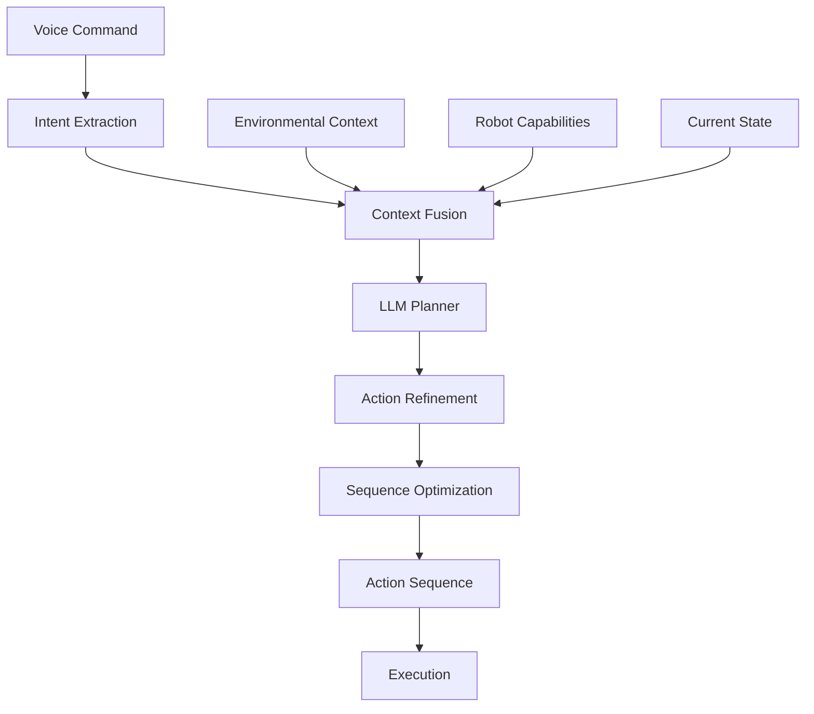

# LLM-Based Action Planning

## Overview

Large Language Models (LLMs) play a central role in the VLA system by enabling cognitive planning capabilities. Unlike traditional robotics systems that rely on pre-programmed behaviors, the VLA system uses LLMs to interpret natural language commands and generate complex, flexible action sequences that can handle novel situations and multi-step tasks.

## Role of LLMs in Cognitive Planning

LLMs serve as the cognitive layer between high-level commands and low-level robot actions. Their key functions include:

- **Semantic Understanding**: Converting natural language to structured representations
- **Context Reasoning**: Taking environmental context into account when planning
- **Action Sequencing**: Creating step-by-step plans for complex tasks
- **Common-Sense Reasoning**: Applying world knowledge to physical tasks
- **Adaptive Planning**: Modifying plans based on feedback and changing conditions

## Architecture

The LLM-based planning system consists of several components:



### 1. Intent Extraction
The system first identifies the core intent from the natural language command:

- Command classification (navigation, manipulation, perception, etc.)
- Entity extraction (objects, locations, parameters)
- Ambiguity detection and resolution

### 2. Context Fusion
Environmental and robot context is integrated with the command intent:

- Robot capabilities and limitations
- Current environment layout and objects
- Recent history and context

### 3. LLM Planner
The LLM generates action sequences based on:

- Natural language understanding
- Context integration
- World knowledge and common sense
- Task decomposition

### 4. Action Refinement
Generated actions are refined for robot execution:

- Conversion to robot-specific commands
- Parameter validation
- Safety checks

### 5. Sequence Optimization
The action sequence is optimized:

- Efficient ordering of steps
- Resource allocation
- Redundancy elimination

## Implementation Approaches

### Prompt Engineering
The LLM planning relies heavily on effective prompt engineering:

```python
class LLMPlanner:
    def __init__(self, model_name="gpt-4"):
        self.model_name = model_name
        
    def generate_plan(self, command, context):
        prompt = f"""You are an action planner for a humanoid robot. 
        Given the command and context below, create a detailed sequence of actions.

        Command: {command.text}
        Intent: {command.intent}
        Parameters: {command.parameters}

        Context:
        - Robot capabilities: {context.capabilities}
        - Environment: {context.environment}
        - Current robot state: {context.robot_state}
        - Available objects: {context.objects}

        Provide the action sequence as a JSON array with the following structure:
        [
          {{
            "id": "unique_step_id",
            "action_type": "navigation|manipulation|perception|other",
            "parameters": {{
              "target_x": float, "target_y": float,  # For navigation
              "target_object": str,  # For manipulation/perception
              "description": str
            }},
            "timeout": int,  # seconds
            "order": int  # execution order
          }}
        ]

        Ensure the plan is:
        1. Feasible with the robot's capabilities
        2. Safe for the environment
        3. Efficient
        4. Complete - achieving the original goal

        Respond with only the JSON array, no other text.
        """
        
        response = openai.ChatCompletion.create(
            model=self.model_name,
            messages=[{"role": "user", "content": prompt}],
            temperature=0.3,
            max_tokens=1000
        )
        
        try:
            return json.loads(response.choices[0].message.content)
        except json.JSONDecodeError:
            # Handle invalid JSON response
            return self._generate_default_plan(command)
```

### Multi-Modal Integration
LLM planning incorporates information from multiple modalities:

```python
class MultimodalLLMPlanner:
    def __init__(self, llm_model_name="gpt-4-vision"):
        self.llm = LLMPlanner(model_name=llm_model_name)
        
    def generate_multimodal_plan(self, voice_command, vision_data, context):
        # Create a comprehensive prompt with both language and visual information
        visual_description = self._describe_vision_data(vision_data)
        
        prompt = f"""You are an action planner for a humanoid robot with vision capabilities.
        
        Voice command: {voice_command.text}
        Visual scene: {visual_description}
        
        Context:
        - Robot capabilities: {context.capabilities}
        - Current environment: {context.environment}
        
        Generate an action plan that considers both the language command and visual input.
        For example, if the command is "pick up the red cup" and the visual input shows
        multiple cups, select the correct one based on the visual input.
        
        Provide the plan in JSON format as specified previously.
        """
        
        return self.llm.generate_plan_from_prompt(prompt)
```

### Task Decomposition
Complex tasks are broken down into manageable steps:

```python
class TaskDecomposer:
    def decompose_task(self, high_level_task, context):
        # Identify subtasks for complex commands
        if "and" in high_level_task or "," in high_level_task:
            # Decompose compound commands
            subtasks = self._split_compound_command(high_level_task)
        elif self._is_complex_task(high_level_task):
            # Decompose complex single commands into subtasks
            subtasks = self._break_down_complex_task(high_level_task, context)
        else:
            subtasks = [high_level_task]
        
        return subtasks
    
    def _break_down_complex_task(self, task, context):
        # Example: "Set the table" -> ["find plates", "find cups", "place items"]
        decomposition_prompt = f"""
        Decompose the following complex task into simpler, executable subtasks:
        
        Task: {task}
        
        Robot capabilities: {context.capabilities}
        Environment: {context.environment}
        
        Return a list of subtasks that need to be performed in sequence to achieve the overall goal.
        Each subtask should be specific enough to be converted to a basic robot action.
        
        Format as JSON: ["subtask1", "subtask2", ...]
        """
        
        response = openai.ChatCompletion.create(
            model="gpt-4",
            messages=[{"role": "user", "content": decomposition_prompt}]
        )
        
        try:
            return json.loads(response.choices[0].message.content)
        except json.JSONDecodeError:
            return [task]  # If decomposition fails, return the original task
```

## Planning Strategies

### Hierarchical Planning
For complex tasks, the system uses hierarchical planning:

- High-level plan: Major task components
- Low-level execution: Specific robot actions for each component
- Flexible composition: Ability to substitute components based on context

### Reactive Planning
The system adapts plans based on execution feedback:

- Monitor execution progress
- Detect deviations from expected outcomes
- Modify plans dynamically
- Retry with alternative approaches

### Contingency Planning
Multiple plans are prepared for different scenarios:

- Primary plan for expected conditions
- Backup plans for common failures
- Recovery plans for unexpected situations

## Challenges and Solutions

### Over-Generation
**Challenge**: LLMs may generate overly complex plans.

**Solution**: 
- Use structured outputs with clear schemas
- Limit plan depth and complexity
- Validate plans with action validators

### Misalignment with Reality
**Challenge**: Plans may not align with physical constraints.

**Solution**:
- Integrate real-time perception feedback
- Use grounded language models trained on robotic data
- Implement extensive validation steps

### Temporal Reasoning
**Challenge**: LLMs struggle with precise timing.

**Solution**:
- Add explicit time constraints to prompts
- Use specialized timing models alongside LLMs
- Implement time-aware validation

## Performance Optimization

### Caching
- Cache frequent command interpretations
- Store successful action sequences as templates
- Pre-compute common planning patterns

### Prompt Optimization
- Use chain-of-thought prompting for complex reasoning
- Provide examples in prompt context
- Optimize for token efficiency

### Model Selection
- Use different models for different tasks (e.g., smaller models for simple commands)
- Consider open-source alternatives for privacy/security
- Balance cost vs. performance requirements

## Evaluation Metrics

### Plan Quality
- **Completeness**: Does the plan achieve the intended goal?
- **Correctness**: Are all steps feasible with robot capabilities?
- **Efficiency**: Is the plan optimal in terms of steps/time/resources?

### Execution Success
- **Success Rate**: Percentage of plans successfully executed
- **Failure Recovery**: How well the system handles plan failures
- **Adaptation**: Ability to revise plans during execution

### User Experience
- **Naturalness**: How intuitive is the command interface?
- **Responsiveness**: How quickly are commands processed and executed?
- **Reliability**: How consistently does the system work?

## Best Practices

1. **Use Structured Prompts**: Well-designed prompts yield more consistent outputs
2. **Validate Generated Actions**: Always verify LLM output before execution
3. **Maintain Context**: Preserve execution history for better planning
4. **Plan for Uncertainty**: Include contingency plans for likely failures
5. **Iterative Refinement**: Continuously improve planning based on execution results

## Advanced Techniques

### Few-Shot Learning
Provide examples of successful plans for similar commands:

```python
FEW_SHOT_EXAMPLES = [
    {
        "command": "Move the red cup from the table to the shelf",
        "plan": [
            {"action_type": "navigation", "parameters": {"x": 1.0, "y": 0.5}},
            {"action_type": "perception", "parameters": {"action": "detect", "target": "red cup"}},
            {"action_type": "manipulation", "parameters": {"action": "grasp", "target": "red cup"}},
            {"action_type": "navigation", "parameters": {"x": 0.5, "y": 1.2}},
            {"action_type": "manipulation", "parameters": {"action": "place", "target": "shelf"}}
        ]
    },
    # More examples...
]
```

### Chain-of-Thought Reasoning
Encourage step-by-step reasoning:

```python
def generate_plan_with_reasoning(self, command, context):
    prompt = f"""Think step-by-step about how to execute the command: {command}
    
    Step 1: What is the ultimate goal?
    Step 2: What objects are needed?
    Step 3: What locations are involved?
    Step 4: What sequence of actions would achieve this?
    Step 5: How would the robot physically perform each action?
    
    Finally, provide the action plan as JSON.
    """
    
    # Implementation continues...
```

## Integration with Other Components

### Vision Integration
LLM planning benefits from visual context:

- Object detection and localization
- Scene understanding
- Spatial reasoning

### Navigation Integration
Plans incorporate navigation constraints:

- Map awareness
- Obstacle avoidance
- Path optimization

### Manipulation Integration
Physical constraints guide action generation:

- Reachability
- Grasp planning
- Collision avoidance

## Future Directions

### Improved Grounding
Better alignment between language understanding and physical execution through:
- Vision-language models specifically trained for robotics
- Embodied AI approaches
- Interactive learning from human feedback

### Collaborative Planning
Incorporating human input during planning:
- Querying users for clarification
- Allowing plan modification
- Learning from corrections

### Lifelong Learning
Continuous improvement of planning abilities:
- Learning from execution successes/failures
- Adapting to new environments and tasks
- Building reusable skills and behaviors

## Conclusion

LLM-based action planning provides the cognitive capabilities needed for natural human-robot interaction in the VLA system. By combining language understanding with robotic execution, the system can handle novel commands and complex multi-step tasks that would be difficult to program using traditional methods.

Success in implementing LLM planning requires careful attention to prompt design, validation, and integration with perception and control systems. The approach enables more flexible, intuitive, and capable robotic systems.