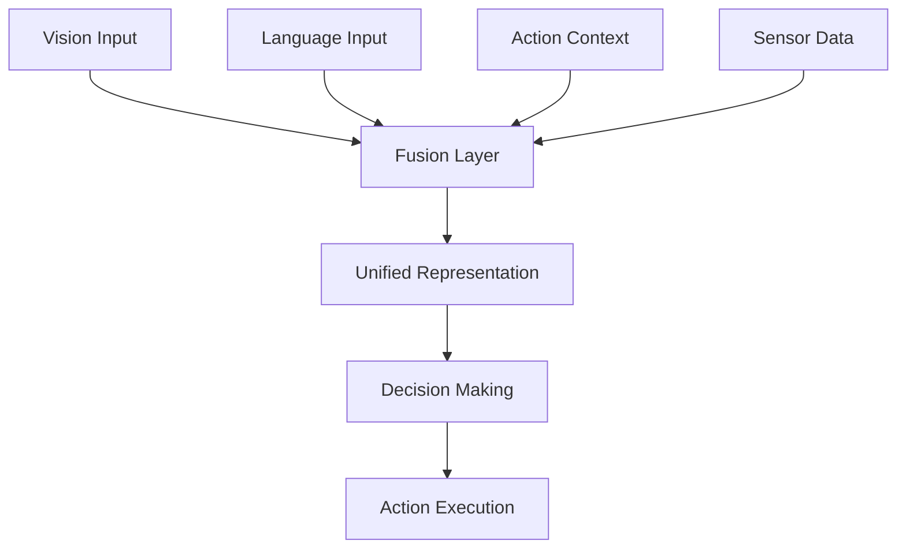

# Multimodal Fusion Integration

## Overview

Multimodal fusion is the core integration mechanism in the Vision-Language-Action (VLA) system that combines information from multiple sensory modalities - vision, language, and action - to make intelligent decisions. This fusion enables the system to create a unified understanding of the environment and tasks, leading to more robust and capable robot behavior.

## Architecture

The multimodal fusion system integrates the following modalities:

- **Vision**: Real-time perception of the environment and objects
- **Language**: Natural language commands and queries
- **Action**: Robot state, capabilities, and execution feedback
- **Sensor**: Additional data from depth sensors, IMU, etc.



### Fusion Approach

The system employs a hierarchical fusion approach:

1. **Early Fusion**: Raw data from similar modalities are combined early in the pipeline
2. **Late Fusion**: Higher-level features from different modalities are combined later
3. **Intermediate Fusion**: Selected modalities are combined at specific integration points
4. **Attention-Based Fusion**: Attention mechanisms determine the relevance of different modalities

## Fusion Techniques

### 1. Early Fusion

Early fusion combines raw or low-level features from similar modalities before higher-level processing:

```python
class EarlyFusionModule:
    def __init__(self):
        self.vision_encoder = VisionEncoder()
        self.audio_encoder = AudioEncoder()
        
    def fuse_modalities(self, vision_data, audio_data):
        # Encode visual features
        vis_features = self.vision_encoder.encode(vision_data)
        
        # Encode audio features
        audio_features = self.audio_encoder.encode(audio_data)
        
        # Concatenate features
        combined_features = torch.cat([vis_features, audio_features], dim=-1)
        
        # Project to shared embedding space
        fused_embedding = self.projection_layer(combined_features)
        
        return fused_embedding
```

### 2. Late Fusion

Late fusion combines high-level features after independent processing:

```python
class LateFusionModule:
    def __init__(self):
        self.vision_processor = VisionProcessor()
        self.language_processor = LanguageProcessor()
        
    def fuse_modalities(self, vision_data, language_data):
        # Process modalities independently
        vis_output = self.vision_processor.process(vision_data)
        lang_output = self.language_processor.process(language_data)
        
        # Combine high-level representations
        combined_output = self.combine_representations(vis_output, lang_output)
        
        return combined_output
```

### 3. Attention-Based Fusion

Attention mechanisms determine the importance of different modalities:

```python
class AttentionBasedFusion:
    def __init__(self, d_model=512, num_heads=8):
        self.self_attention = MultiHeadAttention(d_model, num_heads)
        self.layer_norm = nn.LayerNorm(d_model)
        
    def fuse_with_attention(self, modalities):
        """
        Fuse multiple modalities using self-attention mechanism.
        
        Args:
            modalities: List of tensors from different modalities
        """
        # Stack modalities along a new dimension
        stacked_modalities = torch.stack(modalities, dim=1)
        
        # Apply self-attention to allow modalities to attend to each other
        attended_features = self.self_attention(stacked_modalities, stacked_modalities, stacked_modalities)
        
        # Apply residual connection and layer norm
        fused_features = self.layer_norm(attended_features + stacked_modalities)
        
        # Aggregate across modality dimension
        aggregated_features = torch.mean(fused_features, dim=1)
        
        return aggregated_features
```

## VLA Architectures

### RT-1: Robot Transformer 1
- Maps language and vision to robot actions
- Uses transformer architecture for sequence modeling
- Trained on large-scale robot datasets

### RT-2: Robot Transformer 2
- Extends RT-1 with language model integration
- Better generalization to novel situations
- Improved reasoning capabilities

### OpenVLA: Open Vision-Language-Action Model
- Supports open-vocabulary manipulation
- Trained on diverse datasets
- Better generalization to novel objects

### PaLM-E: Embodied Language Model
- Large language model with embodied reasoning
- Excels at complex multi-step tasks
- High computational requirements

## Implementation

### Fusion Service

The fusion service manages the integration of modalities:

```python
class MultimodalFusionService:
    def __init__(self):
        self.vision_processor = VisionIntegrationService()
        self.language_processor = LanguageProcessor()
        self.action_processor = ActionProcessor()
        self.conflict_resolver = ConflictResolver()
        self.confidence_manager = ConfidenceManager()
        
        # Initialize fusion methods
        self.fusion_methods = {
            "early": EarlyFusionModule(),
            "late": LateFusionModule(),
            "attention": AttentionBasedFusion(),
            "probabilistic": ProbabilisticFusionModule(),
            "intermediate": IntermediateFusionModule()
        }
        
        self.active_method = "attention"  # Default method
    
    async def fuse_modalities(
        self,
        voice_data: Dict[str, Any],
        vision_data: Dict[str, Any],
        sensor_data: Dict[str, Any],
        context: Optional[Dict[str, Any]] = None
    ) -> Tuple[Dict[str, Any], float]:
        """
        Fuse information from multiple modalities to generate actionable decisions.
        
        Args:
            voice_data: Processed voice command information
            vision_data: Processed visual perception data
            sensor_data: Processed sensor data
            context: Additional contextual information
            
        Returns:
            Tuple of (fused_result, confidence)
        """
        try:
            # Select appropriate fusion method based on context
            fusion_method = self._select_fusion_method(voice_data, vision_data, context)
            
            # Perform the fusion
            if fusion_method == "early":
                result, confidence = await self._early_fusion(voice_data, vision_data, sensor_data)
            elif fusion_method == "late":
                result, confidence = await self._late_fusion(voice_data, vision_data, sensor_data)
            elif fusion_method == "attention":
                result, confidence = await self._attention_fusion(voice_data, vision_data, sensor_data, context)
            elif fusion_method == "probabilistic":
                result, confidence = await self._probabilistic_fusion(voice_data, vision_data, sensor_data)
            elif fusion_method == "intermediate":
                result, confidence = await self._intermediate_fusion(voice_data, vision_data, sensor_data)
            else:
                # Default to attention-based fusion
                result, confidence = await self._attention_fusion(voice_data, vision_data, sensor_data, context)
            
            # Detect and resolve conflicts between modalities
            conflicts = self.conflict_resolver.detect_conflicts(voice_data, vision_data, sensor_data)
            if conflicts:
                resolution_result = self.conflict_resolver.resolve_conflicts(
                    conflicts, voice_data, vision_data, sensor_data
                )
                # Apply resolution to result
                result = self._apply_resolution_to_result(result, resolution_result)
            
            return result, confidence
            
        except Exception as e:
            print(f"Error in multimodal fusion: {str(e)}")
            # Return default result with low confidence in case of error
            return {"intent": "unknown", "parameters": {}}, 0.1
    
    def _select_fusion_method(
        self,
        voice_data: Dict[str, Any],
        vision_data: Dict[str, Any],
        context: Optional[Dict[str, Any]]
    ) -> str:
        """
        Select the appropriate fusion method based on input characteristics.
        
        Args:
            voice_data: Voice command data
            vision_data: Visual perception data
            context: Additional context
            
        Returns:
            Name of selected fusion method
        """
        # Select fusion method based on:
        # - Confidence levels in different modalities
        # - Type of command
        # - Environmental conditions
        # - Available computational resources
        
        voice_confidence = voice_data.get("confidence", 0.5)
        vision_confidence = vision_data.get("confidence", 0.5)
        
        # If vision confidence is much higher than voice confidence, use methods that emphasize vision
        if vision_confidence > voice_confidence + 0.2:
            return "attention"
        
        # If both modalities have high confidence, use attention-based fusion
        if voice_confidence > 0.7 and vision_confidence > 0.7:
            return "attention"
        
        # If one modality has very low confidence, potentially use early fusion to emphasize the reliable one
        if voice_confidence < 0.3 or vision_confidence < 0.3:
            return "probabilistic"
        
        # Default to attention-based fusion
        return "attention"
    
    async def _attention_fusion(
        self,
        voice_data: Dict[str, Any],
        vision_data: Dict[str, Any],
        sensor_data: Dict[str, Any],
        context: Optional[Dict[str, Any]]
    ) -> Tuple[Dict[str, Any], float]:
        """
        Perform attention-based fusion of modalities.
        
        Args:
            voice_data: Voice command data
            vision_data: Visual perception data
            sensor_data: Sensor data
            context: Additional context
            
        Returns:
            Tuple of (fused_result, confidence)
        """
        # Convert input data to embeddings
        voice_embedding = self._create_voice_embedding(voice_data)
        vision_embedding = self._create_vision_embedding(vision_data)
        sensor_embedding = self._create_sensor_embedding(sensor_data)
        
        # Apply attention-based fusion
        modalities = [voice_embedding, vision_embedding, sensor_embedding]
        fused_embedding = self.fusion_methods["attention"].fuse_with_attention(modalities)
        
        # Decode the fused embedding to actionable result
        result = self._decode_fused_embedding(fused_embedding, context)
        
        # Calculate confidence based on input modalities' confidences
        voice_conf = voice_data.get("confidence", 0.5)
        vision_conf = vision_data.get("confidence", 0.5)
        sensor_conf = sensor_data.get("confidence", 0.5) if sensor_data else 0.5
        
        # Weight confidence by modality reliability
        confidence = self.confidence_manager.calculate_overall_confidence(
            voice_confidence=voice_conf,
            vision_confidence=vision_conf,
            sensor_confidence=sensor_conf
        )
        
        return result, confidence
    
    def _create_voice_embedding(self, voice_data: Dict[str, Any]) -> torch.Tensor:
        """
        Create an embedding from voice command data.
        
        Args:
            voice_data: Voice command data
            
        Returns:
            Embedding tensor
        """
        # Extract relevant features from voice data
        text = voice_data.get("transcribed_text", "")
        intent = voice_data.get("intent", "")
        confidence = voice_data.get("confidence", 0.5)
        parameters = voice_data.get("parameters", {})
        
        # In a real implementation, this would use a text encoder
        # For this example, we'll create a simple embedding
        feature_vector = [
            hash(text) % 10000,  # Text hash as simple representation
            hash(intent) % 10000 if intent else 0,
            confidence,
            len(parameters)
        ]
        
        return torch.tensor(feature_vector, dtype=torch.float32)
    
    def _create_vision_embedding(self, vision_data: Dict[str, Any]) -> torch.Tensor:
        """
        Create an embedding from visual perception data.
        
        Args:
            vision_data: Visual perception data
            
        Returns:
            Embedding tensor
        """
        # Extract relevant features from vision data
        objects = vision_data.get("objects", [])
        scene_description = vision_data.get("scene_description", "")
        confidence = vision_data.get("confidence", 0.5)
        
        # Create simple embedding (in reality, this would use visual encoders)
        feature_vector = [
            len(objects),
            hash(scene_description) % 10000 if scene_description else 0,
            confidence,
            # Average object confidence if available
            sum(obj.get("confidence", 0.0) for obj in objects) / max(1, len(objects))
        ]
        
        return torch.tensor(feature_vector, dtype=torch.float32)
    
    def _create_sensor_embedding(self, sensor_data: Dict[str, Any]) -> torch.Tensor:
        """
        Create an embedding from sensor data.
        
        Args:
            sensor_data: Sensor data
            
        Returns:
            Embedding tensor
        """
        # Create embedding from sensor data
        if not sensor_data:
            # Return neutral embedding if no sensor data available
            return torch.zeros(4, dtype=torch.float32)
        
        # Extract key sensor measurements
        lidar_distances = sensor_data.get("lidar", {}).get("distances", [])
        imu_data = sensor_data.get("imu", {})
        position = sensor_data.get("position", {"x": 0.0, "y": 0.0, "z": 0.0})
        
        feature_vector = [
            min(lidar_distances) if lidar_distances else 10.0,  # Closest obstacle
            imu_data.get("linear_acceleration", 0.0),
            position["x"],
            position["y"]
        ]
        
        return torch.tensor(feature_vector, dtype=torch.float32)
    
    def _decode_fused_embedding(
        self,
        fused_embedding: torch.Tensor,
        context: Optional[Dict[str, Any]]
    ) -> Dict[str, Any]:
        """
        Decode the fused embedding into an actionable result.
        
        Args:
            fused_embedding: The fused embedding tensor
            context: Additional context
            
        Returns:
            Decoded result as dictionary
        """
        # This would decode the embedding back to meaningful information
        # In a real implementation, this would use a decoder network
        
        # For this example, we'll interpret the embedding as follows:
        emb_values = fused_embedding.detach().cpu().numpy()
        
        # Interpret the embedding values
        if len(emb_values) >= 4:
            # Use the first few values to determine intent and parameters
            intent_confidence = abs(emb_values[0]) % 1.0  # Normalize to 0-1
            x_coord = emb_values[1] 
            y_coord = emb_values[2]
            action_type = int(abs(emb_values[3])) % 3  # 0=navigate, 1=manipulate, 2=perceive
            
            action_types = {0: "navigation", 1: "manipulation", 2: "perception"}
            
            result = {
                "intent": action_types[action_type],
                "parameters": {
                    "x": float(x_coord),
                    "y": float(y_coord),
                    "action_type": action_types[action_type]
                },
                "confidence": float(intent_confidence)
            }
        else:
            result = {
                "intent": "unknown",
                "parameters": {},
                "confidence": 0.5
            }
        
        return result
    
    def _apply_resolution_to_result(
        self,
        original_result: Dict[str, Any],
        resolution_result: Dict[str, Any]
    ) -> Dict[str, Any]:
        """
        Apply conflict resolution to the original fusion result.
        
        Args:
            original_result: Original fusion result
            resolution_result: Conflict resolution result
            
        Returns:
            Updated result after applying resolution
        """
        # Apply resolution changes to the result
        resolved_result = original_result.copy()
        
        resolution_changes = resolution_result.get("resolution_changes", {})
        for key, value in resolution_changes.items():
            resolved_result[key] = value
        
        return resolved_result
```

## Confidence and Uncertainty Management

Effective multimodal fusion requires managing confidence and uncertainty across modalities:

### Confidence Aggregation
Different strategies for combining confidence from different modalities:
- Weighted averaging based on modality reliability
- Bayesian fusion for probabilistic confidence
- Conservative approach (taking minimum confidence)

### Uncertainty Propagation
As information flows through the fusion system, uncertainty is propagated and tracked:
- Aleatoric uncertainty (irreducible data uncertainty)
- Epistemic uncertainty (model uncertainty)
- Systematic uncertainty (consistent model biases)

## Conflict Resolution

Conflicts between modalities must be detected and resolved:

```python
class ConflictResolver:
    """
    Service for detecting and resolving conflicts between modalities.
    """
    
    def detect_conflicts(
        self,
        voice_data: Dict[str, Any],
        vision_data: Dict[str, Any],
        sensor_data: Dict[str, Any]
    ) -> List[Tuple[str, str, str]]:  # (conflict_type, source1, source2)
        """
        Detect conflicts between different modalities.
        
        Returns:
            List of conflicts as (type, source1, source2) tuples
        """
        conflicts = []
        
        # Check for spatial inconsistencies
        if voice_data.get("target_location") and vision_data.get("objects"):
            # Check if target location in voice command matches visible objects in vision
            voice_target = voice_data["target_location"]
            visible_objects = vision_data["objects"]
            
            # Example: If voice says "go to kitchen" but vision shows bedroom objects
            if ("kitchen" in voice_target.lower() and 
                any("bed" in obj.get("class", "").lower() for obj in visible_objects)):
                conflicts.append(("spatial_inconsistency", "voice", "vision"))
        
        # Check for object reference conflicts
        if voice_data.get("target_object") and vision_data.get("objects"):
            voice_obj = voice_data["target_object"]
            vision_objects = [obj["class"] for obj in vision_data["objects"]]
            
            if voice_obj and voice_obj not in vision_objects:
                conflicts.append(("object_reference_conflict", "voice", "vision"))
        
        return conflicts
    
    def resolve_conflicts(
        self,
        conflicts: List[Tuple[str, str, str]],
        voice_data: Dict[str, Any],
        vision_data: Dict[str, Any],
        sensor_data: Dict[str, Any]
    ) -> Dict[str, Any]:
        """
        Resolve detected conflicts.
        
        Args:
            conflicts: List of detected conflicts
            voice_data: Voice command data
            vision_data: Vision data
            sensor_data: Sensor data
            
        Returns:
            Resolution result with strategy used and changes applied
        """
        resolution_result = {
            "strategies_used": [],
            "resolution_changes": {},
            "confidence_adjustment": 0.0
        }
        
        for conflict_type, source1, source2 in conflicts:
            if conflict_type == "spatial_inconsistency":
                # For spatial conflicts, use the more confident modality
                voice_conf = voice_data.get("confidence", 0.5)
                vision_conf = vision_data.get("confidence", 0.5)
                
                if vision_conf > voice_conf:
                    # Trust vision more, adjust result accordingly
                    resolution_result["resolution_changes"]["spatial_context"] = "vision_based"
                    resolution_result["strategies_used"].append("prefer_higher_confidence")
                else:
                    # Trust voice more
                    resolution_result["resolution_changes"]["spatial_context"] = "voice_based"
                    resolution_result["strategies_used"].append("prefer_higher_confidence")
            
            elif conflict_type == "object_reference_conflict":
                # For object conflicts, check sensor data for additional context
                if sensor_data and sensor_data.get("lidar") and sensor_data["lidar"].get("distances"):
                    # Use distance data to determine which modality is likely correct
                    min_distance = min(sensor_data["lidar"]["distances"])
                    if min_distance < 1.0:  # Close objects detected
                        resolution_result["resolution_changes"]["object_context"] = "vision_based"
                        resolution_result["strategies_used"].append("sensor_verification")
                    else:
                        resolution_result["resolution_changes"]["object_context"] = "voice_based"
                        resolution_result["strategies_used"].append("sensor_verification")
        
        return resolution_result
```

## Performance Optimization

### Efficient Fusion Algorithms
- Use lightweight fusion methods when computational resources are limited
- Cache fusion results for repeated patterns
- Asynchronous processing to maintain real-time performance

### Memory Management
- Optimize tensor operations for efficient memory usage
- Implement garbage collection for fusion intermediates
- Use appropriate precision (FP16 vs FP32) based on requirements

## Evaluation Metrics

### Fusion Effectiveness
- **Consistency**: How well do fused decisions align with individual modalities?
- **Robustness**: How well does fusion handle modality failures?
- **Accuracy**: How often do fused decisions lead to successful task completion?

### Confidence Calibration
- **Reliability**: Do confidence scores correlate with actual success rates?
- **Discrimination**: Can the system distinguish between good and poor inputs?

## Challenges and Solutions

### Modality Asynchrony
**Challenge**: Different modalities update at different rates.

**Solution**:
- Implement temporal alignment mechanisms
- Use temporal fusion models that account for timing differences
- Maintain separate state trackers for each modality

### Modality Failure
**Challenge**: Individual modalities may fail or provide poor quality data.

**Solution**:
- Implement robust fallback mechanisms
- Use confidence-aware fusion
- Design graceful degradation paths

### Computational Requirements
**Challenge**: Complex fusion algorithms require significant computational resources.

**Solution**:
- Use efficient approximate fusion methods
- Implement hierarchical fusion (process at different levels of detail)
- Optimize for target hardware platforms

## Integration with System Components

### ROS 2 Integration
The fusion system integrates with ROS 2 for distributed processing:

```yaml
# Example ROS 2 message for fused multimodal data
# multimodal_fusion_msgs/msg/FusionResult.msg
string intent
float32 confidence
geometry_msgs/Pose target_pose
sensor_msgs/ObjectArray detected_objects
string[] strategies_used
```

### Isaac Sim Integration
Fusion results are used in simulation to inform robot behavior and perception.

### Gazebo Integration
Fusion system interfaces with Gazebo for physics simulation and environment modeling.

## Best Practices

1. **Modality-Specific Preprocessing**: Optimize each modality before fusion
2. **Confidence-Aware Processing**: Use confidence scores to weight modality contributions
3. **Context Sensitivity**: Adapt fusion strategy based on task and environmental context
4. **Failure Handling**: Design robust fallback behaviors when modalities are unavailable
5. **Evaluation-Driven Design**: Continuously evaluate fusion effectiveness and adjust

## Future Directions

### Advanced Fusion Techniques
- Neural-symbolic fusion combining neural networks with symbolic reasoning
- Cross-modal transformers for more sophisticated inter-modality attention
- Learning-based fusion methods that adapt to specific domains

### Hierarchical Fusion
- Multi-level fusion processing (feature, decision, and behavior levels)
- Task-adaptive fusion that changes approach based on requirements
- Lifelong learning fusion that improves with experience

### Uncertainty Quantification
- Bayesian fusion methods for principled uncertainty handling
- Uncertainty-aware decision making
- Active sensing to reduce uncertainty in critical situations

## Conclusion

Multimodal fusion is the key integration mechanism that enables the VLA system to combine information from multiple senses into coherent, intelligent behavior. Through careful design of fusion architectures, confidence management, and conflict resolution, the system can leverage the complementary strengths of vision, language, and action to achieve robust autonomous operation.

Success in multimodal fusion requires attention to synchronization, calibration, and domain-specific adaptation, but enables much more capable and flexible robotic systems.