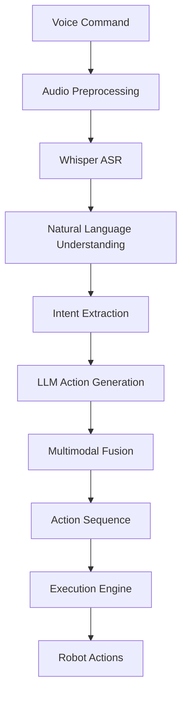

# Voice-to-Action Pipeline

## Overview

The Voice-to-Action pipeline is a critical component of the Vision-Language-Action (VLA) system, enabling humanoid robots to interpret natural language commands and execute them as physical actions. This pipeline integrates multiple AI technologies including automatic speech recognition (ASR), large language models (LLMs), and robotics control to create an intuitive human-robot interaction system.

## Architecture

The voice-to-action pipeline consists of several interconnected components:



### 1. Audio Preprocessing
The pipeline begins with audio preprocessing, which enhances the quality of the incoming voice command. This involves:

- Noise reduction using spectral gating and adaptive filtering
- Voice activity detection to isolate speech from background noise
- Audio normalization to ensure consistent signal levels

### 2. Whisper ASR
OpenAI's Whisper model converts the preprocessed audio to text. This step leverages:

- Multilingual capabilities for diverse command languages
- Robustness to various accents and speaking styles
- Confidence scoring for quality assessment

### 3. Natural Language Understanding
The system analyzes the transcribed text to understand its meaning:

- Named entity recognition to identify objects and locations
- Part-of-speech tagging to differentiate between nouns, verbs, etc.
- Dependency parsing to understand grammatical relationships

### 4. Intent Extraction
Based on the linguistic analysis, the system extracts the core intent:

- Classification of command types (navigation, manipulation, perception)
- Parameter extraction (coordinates, object identifiers, etc.)
- Ambiguity detection and resolution

### 5. LLM Action Generation
Large language models transform the intent into executable action sequences:

- Context-aware planning considering environmental constraints
- Integration of common-sense reasoning
- Generation of step-by-step action plans

### 6. Multimodal Fusion
The vision and language components are fused to create a unified understanding:

- Spatial reasoning combining language references with visual perception
- Confidence aggregation across modalities
- Conflict resolution when modalities disagree

### 7. Action Sequence Generation
The system creates a sequence of low-level actions:

- Conversion of high-level intents to specific robot commands
- Optimization for execution efficiency
- Addition of error recovery and safety checks

### 8. Execution Engine
The action sequence is executed on the robot:

- Real-time monitoring of execution progress
- Dynamic replanning when obstacles arise
- Integration with robot control systems

## Implementation Details

### Audio Processing

The audio preprocessing pipeline uses techniques from digital signal processing to enhance voice commands:

```python
class AudioPreprocessor:
    def __init__(self, sample_rate=16000):
        self.sample_rate = sample_rate
        
    def preprocess(self, audio_data):
        # Apply noise reduction
        denoised = self.spectral_gate(audio_data)
        
        # Normalize volume
        normalized = self.normalize_volume(denoised)
        
        # Detect voice activity
        is_speech, segments = self.voice_activity_detection(normalized)
        
        return normalized if is_speech else None
```

### Natural Language Processing

The NLP pipeline uses transformer-based models to extract meaning from text commands:

```python
class NaturalLanguageProcessor:
    def __init__(self):
        self.tokenizer = AutoTokenizer.from_pretrained("bert-base-uncased")
        self.model = AutoModel.from_pretrained("bert-base-uncased")
        
    def extract_intent(self, text):
        # Tokenize input
        inputs = self.tokenizer(text, return_tensors="pt", padding=True)
        
        # Get embeddings
        outputs = self.model(**inputs)
        embeddings = outputs.last_hidden_state.mean(dim=1)
        
        # Classify intent using trained classifier
        intent = self.intent_classifier(embeddings)
        
        return intent
```

### Action Planning with LLMs

The LLM component translates natural language into action sequences:

```python
class LLMActionPlanner:
    def __init__(self, model_name="gpt-4"):
        self.model_name = model_name
        
    def generate_action_sequence(self, intent, context):
        prompt = f"""
        Convert the following natural language command into a sequence of robotic actions:
        
        Command: {intent.command_text}
        Context: {context}
        
        Robot capabilities: {context.capabilities}
        Environment: {context.environment}
        
        Respond with a JSON array of actions with the following format:
        [
          {{
            "action_type": "navigation|manipulation|perception",
            "parameters": {{...}},
            "description": "Brief description"
          }}
        ]
        
        Only return the JSON array, nothing else.
        """
        
        response = openai.ChatCompletion.create(
            model=self.model_name,
            messages=[{"role": "user", "content": prompt}],
            temperature=0.1
        )
        
        try:
            return json.loads(response.choices[0].message.content)
        except json.JSONDecodeError:
            # Handle malformed response
            return self._generate_default_sequence(intent, context)
```

## Performance Optimization

### Latency Reduction
- Caching of common command patterns
- Edge computing for real-time processing
- Asynchronous processing pipeline

### Accuracy Improvements
- Active learning for domain-specific commands
- Confidence thresholding to filter uncertain responses
- Error recovery mechanisms for failed executions

## Common Use Cases

### Navigation Commands
Commands like "Go to the kitchen" or "Navigate to the red chair" are processed as:

1. Intent classified as navigation
2. Target location identified
3. Path planning initiated
4. Robot moves to location while avoiding obstacles

### Manipulation Commands
Commands like "Pick up the blue cup" or "Place the book on the shelf" involve:

1. Intent classified as manipulation
2. Target object identified in visual input
3. Grasping strategy selected
4. Execution with force and position control

### Multi-step Commands
Natural commands like "Get me a cup of water" are decomposed into:

1. Navigate to the kitchen
2. Locate a cup
3. Grasp the cup
4. Navigate to the sink
5. Fill the cup with water
6. Return to the user

## Challenges and Solutions

### Ambiguous Commands
**Challenge**: Commands like "Pick up that" where "that" is unclear.

**Solution**: The system requests clarification: "Could you specify which object you mean?"

### Environmental Changes
**Challenge**: Objects may move between command and execution.

**Solution**: Continuous perception updates the execution plan dynamically.

### Noise Interference
**Challenge**: Background noise affects voice recognition.

**Solution**: Spectral filtering and multiple microphones for noise suppression.

## Best Practices

1. **Provide Clear Feedback**: Auditory or visual confirmation of command understanding
2. **Design for Ambiguity**: Prepare for unclear or underspecified commands
3. **Handle Failures Gracefully**: Implement error recovery and fallback mechanisms
4. **Consider Safety**: Verify action safety before execution
5. **Test in Real Environments**: Validate performance in typical usage conditions

## Evaluation Metrics

- **Command Understanding Accuracy**: Percentage of commands correctly interpreted
- **Action Execution Success Rate**: Percentage of planned actions successfully executed
- **Latency**: Time from voice input to action initiation
- **User Satisfaction**: Subjective measure of ease of use

## Conclusion

The voice-to-action pipeline enables natural human-robot interaction by transforming spoken language into executable robotic actions. Through careful integration of audio processing, natural language understanding, and robotics control, the VLA system provides an intuitive interface for commanding humanoid robots in various applications.

Success in this pipeline requires attention to speech quality, robust language understanding, and reliable action execution, all integrated into a responsive and safe system.